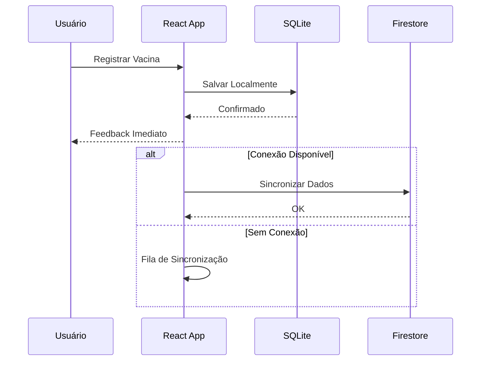
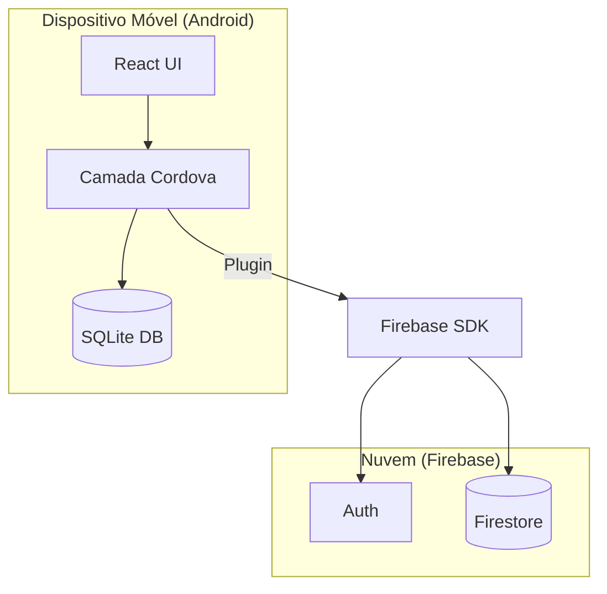

# Visão Geral do Sistema (System Overview)

> Arquitetura técnica do aplicativo **Propriedade Inteligente**.
> Este documento descreve as camadas, componentes e decisões arquiteturais que sustentam o sistema.

---

## 1. Arquitetura em Camadas

O sistema segue uma arquitetura **híbrida mobile** com foco em **Offline-First**.

```text
┌─────────────────────────────────────────────────────────────┐
│                      CAMADA DE PRESENTAÇÃO                  │
│            (React 18 + CSS Modules + Cordova WebView)       │
├─────────────────────────────────────────────────────────────┤
│                     CAMADA DE LÓGICA                        │
│        (Context API + Hooks Customizados + Utils)           │
├─────────────────────────────────────────────────────────────┤
│                    CAMADA DE DADOS                          │
│   ┌─────────────────┐           ┌─────────────────────┐     │
│   │  SQLite (Local)  │ ◄──────► │ Firestore (Remoto)  │     │
│   │  Fonte da Verdade│  Sync    │ Backup e Nuvem      │     │
│   └─────────────────┘           └─────────────────────┘     │
└─────────────────────────────────────────────────────────────┘
```

---

## 2. Componentes Principais

### 2.1. Frontend (React + Cordova)
- **React 18:** Gerencia a interface do usuário com componentes funcionais e hooks.
- **Apache Cordova:** Envelopa a aplicação web, permitindo acesso a recursos nativos (SQLite, Câmera) e publicação na Play Store.
- **CSS Modules:** Estilização isolada por componente para evitar conflitos de CSS.

### 2.2. Banco de Dados Local (SQLite)
- **Função:** Armazenar todas as operações do usuário imediatamente.
- **Vantagem:** O app funciona 100% sem internet. Os dados persistem no dispositivo.
- **Plugin:** `cordova-sqlite-storage`.

### 2.3. Banco de Dados Remoto (Firestore)
- **Função:** Backup na nuvem, sincronização entre dispositivos e autenticação.
- **Modelo:** Coleções para `usuarios`, `propriedades`, `animais`, `ocorrencias`.

### 2.4. Autenticação (Firebase Auth)
- **Método:** E-mail e Senha.
- **Controle de Acesso:** Regras de segurança no Firestore validam se o usuário tem permissão (Dono vs Peão).

---

## 3. Fluxo de Dados (Offline-First)

A estratégia **Offline-First** garante que a experiência do usuário não seja interrompida por falhas de conexão.

1. **Entrada:** Usuário registra dados (ex: vacinação).
2. **Persistência Local:** Dados são salvos imediatamente no **SQLite**.
3. **Verificação de Rede:** O app monitora o status da conexão.
4. **Sincronização:**
   - Se **Online:** Dados são enviados para o **Firestore** em segundo plano.
   - Se **Offline:** Dados ficam na fila até a conexão ser restabelecida.
5. **Resolução de Conflitos:** O timestamp mais recente vence (última escrita).



---

## 4. Decisões Arquiteturais

| Decisão | Justificativa |
|---------|---------------|
| **Cordova ao invés de Nativo** | Menor curva de aprendizado (equipe conhece Web), compartilhamento de código base web. |
| **SQLite ao invés de LocalStorage** | Capacidade de armazenamento maior, suporte a SQL complexo (relações entre animais), melhor performance. |
| **CSS Modules** | Escopo local de estilos evita que mudanças em uma tela afetem outra, essencial em projetos com muitas telas. |
| **Context API** | Solução nativa do React para gerenciamento de estado global, evitando a necessidade de bibliotecas externas como Redux no MVP. |

---

## 5. Requisitos de Ambiente

Para rodar e desenvolver o sistema, é necessário:

- **Node.js:** v20.x LTS
- **JDK:** OpenJDK 17
- **Android Studio:** SDK API 34
- **Firebase:** Projeto configurado (Auth + Firestore)

---

## 6. Estrutura de Diretórios

```text
propriedade-inteligente/
├── platforms/          # Código nativo gerado pelo Cordova
├── plugins/            # Plugins instalados (SQLite, Camera)
├── www/                # Build de produção (código compilado)
├── src/                # Código fonte (React)
│   ├── components/     # Componentes reutilizáveis
│   ├── pages/          # Telas do aplicativo
│   ├── services/       # Integrações (Firebase, SQLite)
│   └── contexts/       # Estado global
└── config.xml          # Configuração do Cordova
```

---

## 7. Diagrama de Componentes (Alto Nível)



---

## 8. Segurança

- **Dados Locais:** Protegidos pelo sandbox do Android (outros apps não acessam).
- **Dados Remotos:** Regras de segurança do Firestore garantem que usuários só leiam/escrevam seus próprios dados.
- **Autenticação:** Gerenciada pelo Firebase Auth (token JWT).
