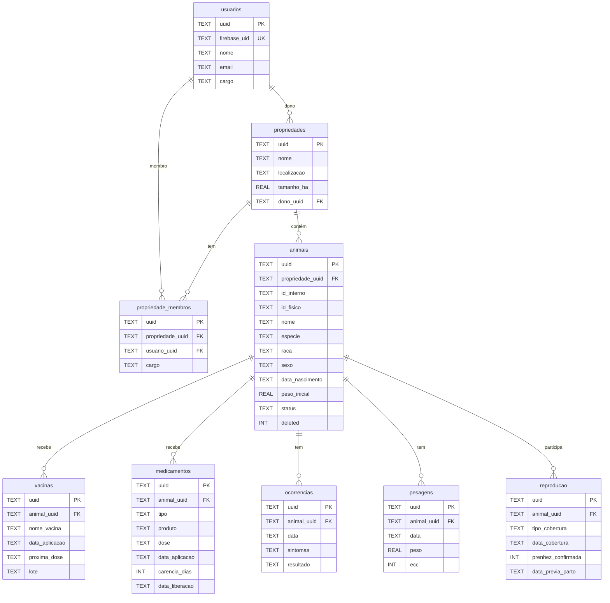

# Schema do Banco de Dados

> Modelo relacional do **Propriedade Inteligente** — SQLite local (9 tabelas MVP) + Firestore remoto.
> Decisões: UUID v4 para IDs, FKs seletivas, colunas de metadados de sincronização em cada tabela.

---

## 1. Resumo das Tabelas (MVP)

| #  | Tabela                | Descrição                                      | Soft Delete |
|----|-----------------------|------------------------------------------------|-------------|
| 1  | `usuarios`            | Dados do usuário autenticado                   | Não         |
| 2  | `propriedades`        | Propriedades rurais cadastradas                | Não         |
| 3  | `propriedade_membros` | Vínculo usuário ↔ propriedade (nível de acesso)| Não         |
| 4  | `animais`             | Ficha individual de cada animal                | Sim         |
| 5  | `vacinas`             | Calendário de vacinas e registros de aplicação | Não         |
| 6  | `medicamentos`        | Tratamentos, vermifugação e carência           | Não         |
| 7  | `ocorrencias`         | Ocorrências clínicas (sintomas, tratamento)    | Não         |
| 8  | `pesagens`            | Histórico de pesagens e GMD                    | Não         |
| 9  | `reproducao`          | Ciclo reprodutivo (cobertura → parto)          | Não         |

> **Pós-MVP:** `producao_leite`, `financeiro`, `areas_fazenda` serão adicionados nas sprints 6-10.

---

## 2. Colunas de Metadados (Presentes em TODAS as tabelas)

Cada tabela possui as seguintes colunas para controle de sincronização:

```sql
uuid           TEXT PRIMARY KEY    -- UUID v4 gerado localmente
created_at     TEXT NOT NULL       -- ISO 8601 (ex: 2026-05-26T14:30:00.000Z)
updated_at     TEXT NOT NULL       -- ISO 8601, atualizado a cada modificação
synced_at      TEXT                -- ISO 8601 da última sincronização bem-sucedida
sync_status    TEXT DEFAULT 'novo' -- 'novo' | 'modificado' | 'sincronizado'
deleted        INTEGER DEFAULT 0  -- Soft delete: 0 = ativo, 1 = deletado (apenas em `animais`)
```

---

## 3. Definição de Cada Tabela

### 3.1. usuarios

```sql
CREATE TABLE usuarios (
    uuid           TEXT PRIMARY KEY,
    firebase_uid   TEXT UNIQUE NOT NULL,      -- UID do Firebase Auth
    nome           TEXT NOT NULL,
    email          TEXT UNIQUE NOT NULL,
    cargo          TEXT DEFAULT 'dono',       -- 'dono' | 'peao'
    foto_url       TEXT,
    created_at     TEXT NOT NULL,
    updated_at     TEXT NOT NULL,
    synced_at      TEXT,
    sync_status    TEXT DEFAULT 'novo'
);

CREATE INDEX idx_usuarios_firebase_uid ON usuarios(firebase_uid);
CREATE INDEX idx_usuarios_email ON usuarios(email);
```

**Notas:**
- `firebase_uid` é o UID retornado pelo Firebase Auth no login.
- `cargo` define o nível de acesso global do usuário (pode ser refinado por propriedade via `propriedade_membros`).

---

### 3.2. propriedades

```sql
CREATE TABLE propriedades (
    uuid           TEXT PRIMARY KEY,
    nome           TEXT NOT NULL,
    localizacao    TEXT NOT NULL,              -- Cidade, UF (ex: "Concórdia, SC")
    tamanho_ha     REAL,                       -- Tamanho em hectares (opcional)
    dono_uuid      TEXT NOT NULL,              -- FK → usuarios.uuid (quem criou)
    created_at     TEXT NOT NULL,
    updated_at     TEXT NOT NULL,
    synced_at      TEXT,
    sync_status    TEXT DEFAULT 'novo'
);

CREATE INDEX idx_propriedades_dono ON propriedades(duno_uuid);
```

**FK seletiva:** `dono_uuid` referencia `usuarios.uuid` — validada no app, não no SQLite.

---

### 3.3. propriedade_membros

```sql
CREATE TABLE propriedade_membros (
    uuid             TEXT PRIMARY KEY,
    propriedade_uuid TEXT NOT NULL,             -- FK → propriedades.uuid
    usuario_uuid     TEXT NOT NULL,             -- FK → usuarios.uuid
    cargo            TEXT DEFAULT 'peao',       -- 'dono' | 'peao'
    convidado_por    TEXT,                      -- UUID de quem convidou
    created_at       TEXT NOT NULL,
    updated_at       TEXT NOT NULL,
    synced_at        TEXT,
    sync_status      TEXT DEFAULT 'novo'
);

CREATE INDEX idx_membros_propriedade ON propriedade_membros(propriedade_uuid);
CREATE INDEX idx_membros_usuario ON propriedade_membros(usuario_uuid);
```

**Notas:**
- Tabela de relacionamento N:N entre usuários e propriedades.
- O criador da propriedade é inserido automaticamente como `cargo = 'dono'`.

---

### 3.4. animais

```sql
CREATE TABLE animais (
    uuid             TEXT PRIMARY KEY,
    propriedade_uuid TEXT NOT NULL,             -- FK → propriedades.uuid
    id_interno       TEXT NOT NULL,             -- ID gerado pelo app (ex: "ANI-00001")
    id_fisico        TEXT,                      -- Brinco/Colar/Tag
    nome             TEXT,                      -- Nome/Apelido (opcional)
    especie          TEXT NOT NULL,             -- 'bovino' | 'ovino' | 'suino'
    raca             TEXT NOT NULL,
    sexo             TEXT NOT NULL,             -- 'macho' | 'femea'
    data_nascimento  TEXT NOT NULL,             -- ISO 8601 (YYYY-MM-DD)
    peso_inicial     REAL NOT NULL,             -- Peso em kg na entrada
    pelagem          TEXT,                      -- Descrição visual
    genetica         TEXT,                      -- Ex: "1/2 Angus + 1/2 Nelore"
    origem           TEXT,                      -- De onde veio / histórico
    mae_uuid         TEXT,                      -- FK → animais.uuid (mãe)
    pai_uuid         TEXT,                      -- FK → animais.uuid (pai)
    status           TEXT DEFAULT 'ativo',      -- 'ativo' | 'vendido' | 'morto' | 'consumido'
    created_at       TEXT NOT NULL,
    updated_at       TEXT NOT NULL,
    synced_at        TEXT,
    sync_status      TEXT DEFAULT 'novo',
    deleted          INTEGER DEFAULT 0          -- Soft delete
);

CREATE INDEX idx_animais_propriedade ON animais(propriedade_uuid);
CREATE INDEX idx_animais_id_fisico ON animais(id_fisico);
CREATE INDEX idx_animais_status ON animais(status);
CREATE INDEX idx_animais_especie ON animais(especie);
```

**FKs seletivas:** `propriedade_uuid`, `mae_uuid`, `pai_uuid` — validadas no app.

**Soft delete:** `deleted = 1` remove o animal da lista ativa, mas preserva dados para histórico financeiro e genealógico.

---

### 3.5. vacinas

```sql
CREATE TABLE vacinas (
    uuid             TEXT PRIMARY KEY,
    animal_uuid      TEXT NOT NULL,             -- FK → animais.uuid
    propriedade_uuid TEXT NOT NULL,             -- FK → propriedades.uuid (desnormalização para sync)
    nome_vacina      TEXT NOT NULL,             -- Ex: "Febre Aftosa"
    obrigatoria      INTEGER DEFAULT 0,         -- 0 = opcional, 1 = obrigatória
    ciclo_dias       INTEGER,                   -- Dias até próxima dose (ex: 180)
    data_aplicacao   TEXT NOT NULL,             -- ISO 8601 (YYYY-MM-DD)
    proxima_dose     TEXT,                      -- ISO 8601 calculada (data_aplicacao + ciclo_dias)
    lote             TEXT,                      -- Lote da vacina
    responsavel      TEXT,                      -- Nome de quem aplicou
    created_at       TEXT NOT NULL,
    updated_at       TEXT NOT NULL,
    synced_at        TEXT,
    sync_status      TEXT DEFAULT 'novo'
);

CREATE INDEX idx_vacinas_animal ON vacinas(animal_uuid);
CREATE INDEX idx_vacinas_propriedade ON vacinas(propriedade_uuid);
CREATE INDEX idx_vacinas_proxima_dose ON vacinas(proxima_dose);
```

**Notas:**
- `propriedade_uuid` é desnormalizado para permitir queries rápidas por propriedade sem JOIN.
- `proxima_dose` é calculada no app: `data_aplicacao + ciclo_dias`.

---

### 3.6. medicamentos

```sql
CREATE TABLE medicamentos (
    uuid             TEXT PRIMARY KEY,
    animal_uuid      TEXT NOT NULL,             -- FK → animais.uuid
    propriedade_uuid TEXT NOT NULL,             -- FK → propriedades.uuid
    tipo             TEXT NOT NULL,             -- 'antibiotico' | 'vermifugo' | 'anti-inflamatorio' | 'suplemento' | 'antiparasitario' | 'outro'
    produto          TEXT NOT NULL,             -- Nome do produto (ex: "Ivermectina 1%")
    dose             TEXT NOT NULL,             -- Ex: "5ml"
    data_aplicacao   TEXT NOT NULL,             -- ISO 8601
    carencia_dias    INTEGER,                   -- Período de carência em dias
    data_liberacao   TEXT,                      -- Calculada: data_aplicacao + carencia_dias
    responsavel      TEXT,
    observacao       TEXT,
    created_at       TEXT NOT NULL,
    updated_at       TEXT NOT NULL,
    synced_at        TEXT,
    sync_status      TEXT DEFAULT 'novo'
);

CREATE INDEX idx_medicamentos_animal ON medicamentos(animal_uuid);
CREATE INDEX idx_medicamentos_propriedade ON medicamentos(propriedade_uuid);
CREATE INDEX idx_medicamentos_liberacao ON medicamentos(data_liberacao);
```

**Notas:**
- `data_liberacao` é calculada no app e usada para exibir contagem regressiva de carência.
- `tipo` é um enum em texto (não INTEGER) para facilitar leitura no Firestore.

---

### 3.7. ocorrencias

```sql
CREATE TABLE ocorrencias (
    uuid             TEXT PRIMARY KEY,
    animal_uuid      TEXT NOT NULL,             -- FK → animais.uuid
    propriedade_uuid TEXT NOT NULL,             -- FK → propriedades.uuid
    data             TEXT NOT NULL,             -- ISO 8601
    sintomas         TEXT NOT NULL,             -- Descrição dos sintomas
    tratamento       TEXT,                      -- Tratamento aplicado (opcional)
    resultado        TEXT DEFAULT 'aguardando', -- 'aguardando' | 'em_tratamento' | 'recuperado' | 'obito'
    veterinario      TEXT,                      -- Nome do veterinário (opcional)
    created_at       TEXT NOT NULL,
    updated_at       TEXT NOT NULL,
    synced_at        TEXT,
    sync_status      TEXT DEFAULT 'novo'
);

CREATE INDEX idx_ocorrencias_animal ON ocorrencias(animal_uuid);
CREATE INDEX idx_ocorrencias_propriedade ON ocorrencias(propriedade_uuid);
```

---

### 3.8. pesagens

```sql
CREATE TABLE pesagens (
    uuid             TEXT PRIMARY KEY,
    animal_uuid      TEXT NOT NULL,             -- FK → animais.uuid
    propriedade_uuid TEXT NOT NULL,             -- FK → propriedades.uuid
    data             TEXT NOT NULL,             -- ISO 8601
    peso             REAL NOT NULL,             -- Peso em kg
    ecc              INTEGER,                   -- Score de Condição Corporal (1-5) (opcional)
    observacao       TEXT,
    created_at       TEXT NOT NULL,
    updated_at       TEXT NOT NULL,
    synced_at        TEXT,
    sync_status      TEXT DEFAULT 'novo'
);

CREATE INDEX idx_pesagens_animal ON pesagens(animal_uuid);
CREATE INDEX idx_pesagens_data ON pesagens(data);
```

**Notas:**
- GMD (Ganho Médio Diário) é **calculado em runtime**, não armazenado.
- Fórmula GMD: `(peso_atual - peso_anterior) / dias_entre_pesagens`
- ECC é opcional (escala 1-5).

---

### 3.9. reproducao

```sql
CREATE TABLE reproducao (
    uuid               TEXT PRIMARY KEY,
    animal_uuid        TEXT NOT NULL,             -- FK → animais.uuid (fêmea)
    propriedade_uuid   TEXT NOT NULL,             -- FK → propriedades.uuid
    tipo_cobertura     TEXT NOT NULL,             -- 'monta_natural' | 'inseminacao_artificial'
    data_cobertura     TEXT NOT NULL,             -- ISO 8601
    touro_uuid         TEXT,                      -- FK → animais.uuid (macho usado)
    prenhez_confirmada INTEGER DEFAULT 0,         -- 0 = não, 1 = sim
    data_confirmacao   TEXT,                      -- Data do exame (toque/ultrassom)
    data_previa_parto  TEXT,                      -- Calculada: data_cobertura + 285 dias (bovinos)
    data_secagem       TEXT,                      -- Calculada: data_previa_parto - 60 dias
    data_parto         TEXT,                      -- Preenchida quando o parto ocorre
    observacao         TEXT,
    created_at         TEXT NOT NULL,
    updated_at         TEXT NOT NULL,
    synced_at          TEXT,
    sync_status        TEXT DEFAULT 'novo'
);

CREATE INDEX idx_reproducao_animal ON reproducao(animal_uuid);
CREATE INDEX idx_reproducao_propriedade ON reproducao(propriedade_uuid);
CREATE INDEX idx_reproducao_parto ON reproducao(data_previa_parto);
```

**Notas:**
- `data_previa_parto` é calculada: `data_cobertura + 285 dias` (gestação bovina média).
- `data_secagem` é calculada: `data_previa_parto - 60 dias`.
- Para ovinos, o período de gestação é ~150 dias (configurável no app).

---

## 4. Diagrama Entity-Relationship



---

## 5. Estrutura Firestore (Remoto)

Coleções aninhadas dentro de `propriedade/{propriedadeId}`:

```text
firestore/
└── propriedade/{propriedadeId}
    ├── nome: "Fazenda Norte"
    ├── localizacao: "Sorriso, MT"
    ├── tamanho_ha: 150.5
    ├── dono_uid: "firebase_uid_123"
    ├── created_at: Timestamp
    │
    ├── membros/{membroId}
    │   ├── usuario_uid: "firebase_uid_456"
    │   ├── cargo: "peao"
    │   └── convidado_por: "firebase_uid_123"
    │
    ├── animais/{animalId}
    │   ├── id_interno: "ANI-00001"
    │   ├── id_fisico: "BR-00142"
    │   ├── nome: "Mimosa"
    │   ├── especie: "bovino"
    │   ├── raca: "Nelore"
    │   ├── sexo: "femea"
    │   ├── data_nascimento: "2023-03-15"
    │   ├── peso_inicial: 280.5
    │   ├── status: "ativo"
    │   ├── deleted: false
    │   ├── created_at: Timestamp
    │   ├── updated_at: Timestamp
    │   │
    │   ├── vacinas/{vacinaId}
    │   │   ├── nome_vacina: "Febre Aftosa"
    │   │   ├── data_aplicacao: "2025-07-15"
    │   │   ├── proxima_dose: "2026-01-15"
    │   │   └── lote: "LT-2025-001"
    │   │
    │   ├── medicamentos/{medicamentoId}
    │   │   ├── tipo: "vermifugo"
    │   │   ├── produto: "Ivermectina 1%"
    │   │   ├── dose: "5ml"
    │   │   └── carencia_dias: 30
    │   │
    │   ├── ocorrencias/{ocorrenciaId}
    │   │   ├── sintomas: "Claudicação membro posterior"
    │   │   ├── resultado: "recuperado"
    │   │   └── veterinario: "Dr. João"
    │   │
    │   ├── pesagens/{pesagemId}
    │   │   ├── data: "2025-12-01"
    │   │   └── peso: 320.0
    │   │
    │   └── reproducao/{reproducaoId}
    │       ├── tipo_cobertura: "inseminacao_artificial"
    │       ├── data_cobertura: "2025-08-10"
    │       ├── prenhez_confirmada: true
    │       └── data_previa_parto: "2026-05-22"
    │
    └── areas/{areaId}
        ├── nome: "Pasto Norte"
        └── tipo: "pastagem"
```

---

## 6. Mapeamento SQLite ↔ Firestore

| SQLite                          | Firestore                                    |
|---------------------------------|----------------------------------------------|
| `propriedades.uuid`             | `propriedade/{propriedadeId}`                |
| `animais.uuid`                  | `propriedade/{id}/animais/{animalId}`        |
| `vacinas.uuid`                  | `propriedade/{id}/animais/{aId}/vacinas/{vId}`|
| `medicamentos.uuid`             | `propriedade/{id}/animais/{aId}/medicamentos/{mId}`|
| `ocorrencias.uuid`              | `propriedade/{id}/animais/{aId}/ocorrencias/{oId}`|
| `pesagens.uuid`                 | `propriedade/{id}/animais/{aId}/pesagens/{pId}`|
| `reproducao.uuid`               | `propriedade/{id}/animais/{aId}/reproducao/{rId}`|
| `propriedade_membros.uuid`      | `propriedade/{id}/membros/{membroId}`        |
| `usuarios.uuid`                 | `usuarios/{usuarioId}` (coleção raiz)        |

**Regra:** O `uuid` do SQLite é o mesmo ID do documento Firestore. Isso simplifica a sincronização.

---

## 7. Constantes do Sistema

### Espécies
```javascript
const ESPECIES = ['bovino', 'ovino', 'suino']
```

### Sexos
```javascript
const SEXOS = ['macho', 'femea']
```

### Status do Animal
```javascript
const STATUS_ANIMAL = ['ativo', 'vendido', 'morto', 'consumido']
```

### Tipos de Medicamento
```javascript
const TIPOS_MEDICAMENTO = [
  'antibiotico', 'vermifugo', 'anti-inflamatorio',
  'suplemento', 'antiparasitario', 'outro'
]
```

### Resultados de Ocorrência
```javascript
const RESULTADOS_OCORRENCIA = ['aguardando', 'em_tratamento', 'recuperado', 'obito']
```

### Tipos de Cobertura
```javascript
const TIPOS_COBERTURA = ['monta_natural', 'inseminacao_artificial']
```

### Cargos de Usuário
```javascript
const CARGOS = ['dono', 'peao']
```

### Status de Sync
```javascript
const SYNC_STATUS = ['novo', 'modificado', 'sincronizado']
```

---

## 8. Querys Comuns

### Listar animais de uma propriedade
```sql
SELECT * FROM animais
WHERE propriedade_uuid = ? AND deleted = 0
ORDER BY nome ASC;
```

### Vacinas próximas do vencimento (próximos 7 dias)
```sql
SELECT v.*, a.nome AS nome_animal, a.id_fisico
FROM vacinas v
JOIN animais a ON v.animal_uuid = a.uuid
WHERE v.proxima_dose <= date('now', '+7 days')
  AND a.deleted = 0
ORDER BY v.proxima_dose ASC;
```

### Animais em período de carência
```sql
SELECT m.*, a.nome AS nome_animal, a.id_fisico
FROM medicamentos m
JOIN animais a ON m.animal_uuid = a.uuid
WHERE m.data_liberacao >= date('now')
  AND a.deleted = 0
ORDER BY m.data_liberacao ASC;
```

### GMD de um animal (últimas 2 pesagens)
```sql
SELECT
  p1.peso AS peso_atual,
  p2.peso AS peso_anterior,
  p1.data AS data_atual,
  p2.data AS data_anterior,
  julianday(p1.data) - julianday(p2.data) AS dias,
  (p1.peso - p2.peso) / (julianday(p1.data) - julianday(p2.data)) AS gmd
FROM pesagens p1
JOIN pesagens p2 ON p1.animal_uuid = p2.animal_uuid
WHERE p1.animal_uuid = ?
  AND p1.data = (SELECT MAX(data) FROM pesagens WHERE animal_uuid = ?)
  AND p2.data = (
    SELECT MAX(data) FROM pesagens
    WHERE animal_uuid = ? AND data < (SELECT MAX(data) FROM pesagens WHERE animal_uuid = ?)
  );
```

### Registros pendentes de sincronização
```sql
SELECT * FROM animais
WHERE sync_status IN ('novo', 'modificado')
ORDER BY updated_at ASC;
```
